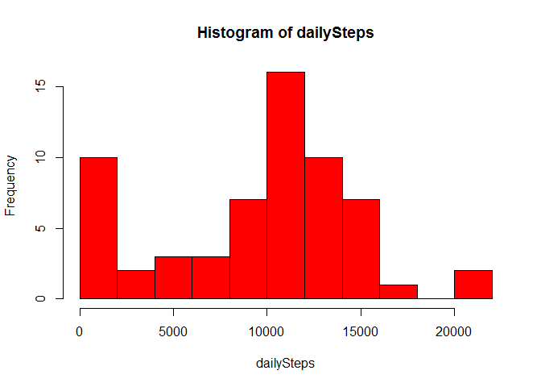
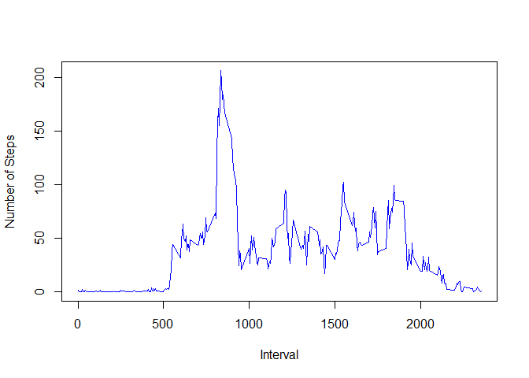
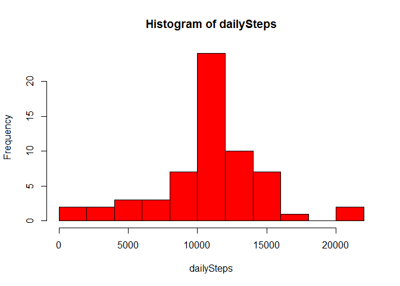

# Reproducible Research: Peer Assessment 1

This report contains the analysis of activity monitoring data obtained from wearable devices. The data is obtained from https://github.com/engr3os/RepData_PeerAssessment1.

Before processing the data we will first include the R packages required for our analysis, set the working directory and read in the data of interest.

## Loading and preprocessing the data

```r
require(lubridate)
require(lattice)
setwd("~/ML_R/RepData_PeerAssessment1")
activity_dat <- read.csv("Activity/activity.csv", colClasses = c("numeric","factor", "factor"))
```


## What is mean total number of steps taken per day?

In order to conduct basic exploratory data analysis, we will take a look at the histogram of the total number of steps taken perday.  

```r
dailySteps <- tapply(activity_dat$steps, activity_dat$date, sum, na.rm = T)
hist(dailySteps, col = "red", breaks = 10)
```

 

```
## [1] "Figure 1. The histogram of the total daily number of steps"
```
The mean and median total number of steps taken per day can be calculated as:


```r
meandailySteps <- mean(dailySteps)
meddailySteps <- median(dailySteps)
print(meandailySteps)
```

```
## [1] 9354.23
```

```r
print(meddailySteps)
```

```
## [1] 10395
```


## What is the average daily activity pattern?
The average daily activity pattern be described by a plot of average daily steps per interval of measurement

```r
meanDailySteps <- tapply(activity_dat$steps, activity_dat$interval, mean, na.rm = T)
interval <- (as.numeric(levels(activity_dat$interval)))
dailyStepDf <- data.frame(interval,meanDailySteps)
dailyStepDf <- dailyStepDf[order(interval), ]
with(dailyStepDf, plot(interval, meanDailySteps, type = "l", col = "blue", ylab = "Number of Steps", xlab = "Interval"))
```

 

```
## [1] "Figure 2. The plot of average number of steps taken over 5-minute intervals"
```

The 5-minute interval, on average across all the days in the dataset, that
contains the maximum number of steps is given by

```r
with(dailyStepDf, interval[which.max(meanDailySteps)])
```

## Imputing missing values
The total number of NA in the activity data set is given by

```r
sum(is.na(activity_dat))
```

```
## [1] 2304
```
The modified data set can be easily obtained as below

```r
modActivity_dat <- merge(activity_dat,dailyStepDf, by = "interval")
NAIndex <- is.na(modActivity_dat$steps)
modActivity_dat$steps[NAIndex] <- modActivity_dat$meanDailySteps[NAIndex]
dailySteps <- tapply(modActivity_dat$steps, modActivity_dat$date, sum, na.rm = T)
hist(dailySteps, col = "red", breaks = 10)
```

 

```
## [1] "Figure 3. The histogram of the total daily number of steps with NAs imputed"
```

The new mean and median can then be calcuated as

```r
meandailySteps <- mean(dailySteps)
meddailySteps <- median(dailySteps)
print(meandailySteps)
```

```
## [1] 10766.19
```

```r
print(meddailySteps)
```

```
## [1] 10766.19
```

Obviously there is diffrence between the total number of steps taken daily with and wihtout data impute. Both the mean and median had increased. More importantly, the new mean and median are equal which shows that the steps measurement is now more normally distributed than it was.  

## Are there differences in activity patterns between weekdays and weekends?

```r
modActivity_dat$day_type <- factor(weekdays(as.Date(modActivity_dat$date)) %in% c("Saturday", "Sunday"))
levels(modActivity_dat$day_type) = c("weekday","weekend")
meanDailySteps <- tapply(modActivity_dat$steps, list(modActivity_dat$interval, modActivity_dat$day_type), mean, na.rm = T)
interval <- as.numeric(levels(modActivity_dat$interval))
dailyStepDf <- data.frame(interval,meanDailySteps)
dailyStepDf <- dailyStepDf[order(interval), ]
temp = reshape(dailyStepDf, direction = "long", varying = c("weekday","weekend"), v.names = "steps", times = c("weekday","weekend"), sep="")
xyplot(steps ~ interval|time, data = temp, type = "l", layout = c(1,2), ylab = "Number of Steps", xlab = "Interval")
```

 

```
## [1] "Figure 4. The plot of average number of steps taken in weekday vs. weekend over 5-minute intervals"
```

It can be observed from the Figure 4 that high number of steps seems to occur in the morning period towards the noon but the number of walking steps reduces and remain flat for the rest of the day until the evening time with little more walking step. This observation is expected since walking around reduces once people get to work in teh morning. Also, people will then be working back to their houses or leaving the office building in the evening after work.

However, for the weekend the activity doesn't really start till after noon as people are mostly sleeping in weekends' morning. However, once they get up they seem to be actively working around till the evening.

Therefore, this activity monitoring data and the analysis seems to be able to provide information to identify which what period of the day is someone likely to be walking a lot or walking less. 
